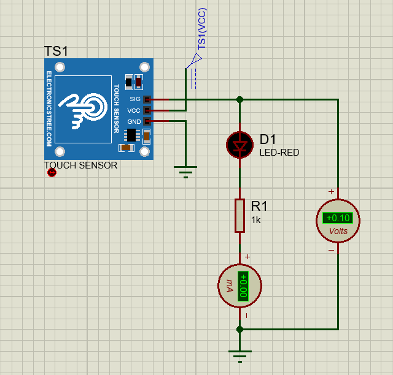
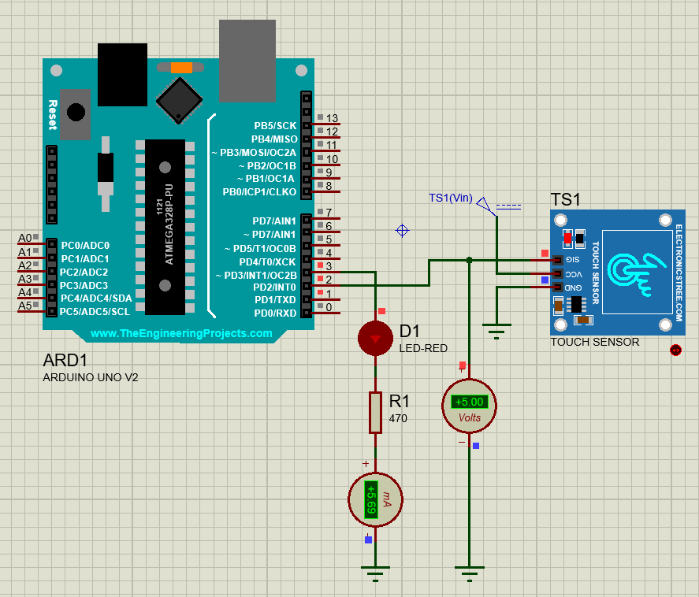

# Touch Sensor

## Summary
This project uses a digital touch sensor (e.g., TTP223) with an Arduino to detect touch events. The program counts the number of touches and prints them to the Serial Monitor **only when a new touch is detected**, avoiding multiple prints while the sensor is continuously pressed.

---

## Components
- Arduino Uno (or any compatible board)  
- Digital Touch Sensor Module (TTP223 or similar)  

---

## Wiring
| Touch Sensor Pin | Arduino Pin |
|-----------------|-------------|
| VCC             | 5V          |
| GND             | GND         |
| OUT             | D2          |

---
